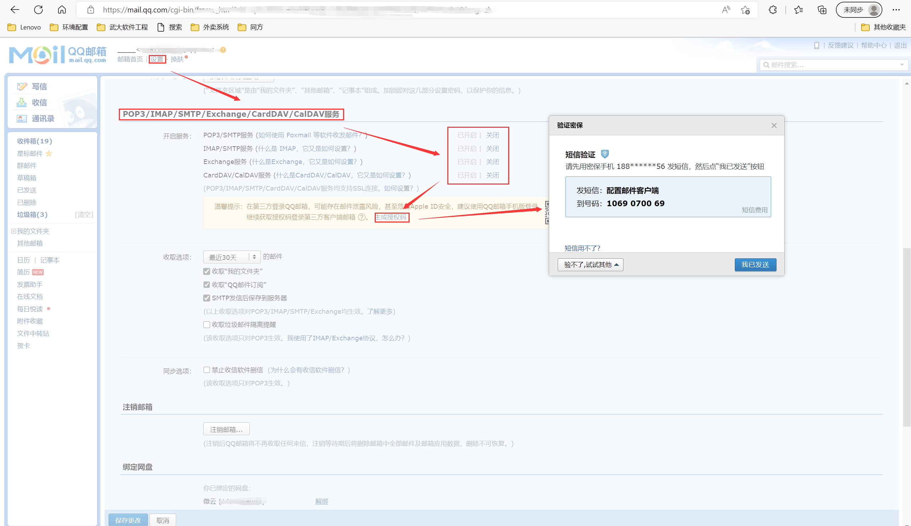

## spring-boot-mail 发送邮件

IDE: Intellij Idea 2020.1 X64

JDK: 1.8.0_271

### 1.配置文件 application.yml:

```yaml
spring:
  mail:
    host: smtp.qq.com
    username: 1491269442@qq.com
    password: ebfoakapdkupjdcc
    properties.mail.smtp.auth: true
    properties.mail.smtp.starttls.enable: true
```

由于此处使用的邮箱引擎是QQ,此处的邮箱password需要使用QQ邮箱生成的授权码，此处将授权码做密码使用。

#### QQ邮箱设置如下：



QQ邮箱授权码：

[QQ邮箱授权码]: https://service.mail.qq.com/cgi-bin/help?subtype=1&&no=1001256&&id=28

### 2.pom.xml依赖引入：

```yaml
 <dependency>
    <groupId>org.springframework.boot</groupId>
    <artifactId>spring-boot-starter-mail</artifactId>
 </dependency>

```

### 3.邮件发送服务：

```java
package tcu.example.springbootemail.srervice;

public interface EmailService {

    void sendSimpleMail();

    void sendHtmlMail();

    void sendAttachmentsMail();

    void sendInlineMail();

    void sendTemplateMail();
}
```

### 4.邮件发送服务实现：

```java
package tcu.example.springbootemail.srervice.Impl;

import lombok.extern.slf4j.Slf4j;
import org.springframework.beans.factory.annotation.Autowired;
import org.springframework.beans.factory.annotation.Value;
import org.springframework.core.io.FileSystemResource;
import org.springframework.mail.SimpleMailMessage;
import org.springframework.mail.javamail.JavaMailSender;
import org.springframework.mail.javamail.MimeMessageHelper;
import org.springframework.stereotype.Service;
import org.thymeleaf.TemplateEngine;
import org.thymeleaf.context.Context;
import tcu.example.springbootemail.srervice.EmailService;
import javax.mail.internet.MimeMessage;
import java.io.File;
import java.util.HashMap;
import java.util.Map;
import java.util.Properties;

@Slf4j
@Service
public class EmailServiceImpl implements EmailService {

    @Autowired
    private JavaMailSender mailSender;

    @Autowired
    private TemplateEngine templateEngine;

    @Value("${spring.mail.username}")
    private String Sender; //读取配置文件中的参数

    @Override
    public void sendSimpleMail() {

        SimpleMailMessage message = new SimpleMailMessage();
        message.setFrom(Sender);
        message.setTo(Sender); //自己给自己发送邮件
        message.setSubject("主题：简单邮件");
        message.setText("测试邮件内容");
        mailSender.send(message);
    }

    @Override
    public void sendHtmlMail() {
        MimeMessage message = null;
        try {
            message = mailSender.createMimeMessage();
            MimeMessageHelper helper = new MimeMessageHelper(message, true);
            helper.setFrom(Sender);
            helper.setTo(Sender);
            helper.setSubject("标题：发送Html内容");

            StringBuffer sb = new StringBuffer();
            sb.append("<h1>大标题-h1</h1>")
                    .append("<p style='color:#F00'>红色字</p>")
                    .append("<p style='text-align:right'>右对齐</p>");
            helper.setText(sb.toString(), true);
        } catch (Exception e) {
            e.printStackTrace();
        }
        mailSender.send(message);
    }

    @Override
    //有附件的邮件
    public void sendAttachmentsMail() {
        MimeMessage message = null;
        try {
            message = mailSender.createMimeMessage();
            MimeMessageHelper helper = new MimeMessageHelper(message, true);
            helper.setFrom(Sender);
            helper.setTo(Sender);
            helper.setSubject("主题：带附件的邮件");
            helper.setText("带附件的邮件内容");
            //注意项目路径问题，自动补用项目路径
            FileSystemResource file = new FileSystemResource(new File("D:/Temp/picture.jpg"));
            //加入邮件
            helper.addAttachment("图片.jpg", file);
        } catch (Exception e){
            e.printStackTrace();
        }
        mailSender.send(message);
    }

    @Override
    //带静态资源的邮件
    public void sendInlineMail() {
        MimeMessage message = null;
        try {
            message = mailSender.createMimeMessage();
            MimeMessageHelper helper = new MimeMessageHelper(message, true);
            helper.setFrom(Sender);
            helper.setTo(Sender);
            helper.setSubject("主题：带静态资源的邮件");
            //第二个参数指定发送的是HTML格式,同时cid:是固定的写法
            helper.setText("<html><body>带静态资源的邮件内容 图片:</body></html>", true);

            FileSystemResource file = new FileSystemResource(new File("D:/Temp/picture.jpg"));
            helper.addInline("picture",file);
        } catch (Exception e){
            e.printStackTrace();
        }
        mailSender.send(message);
    }

    @Override
    //批量邮件
    public void sendTemplateMail() {

        String[] filePath = new String[]{"D:\\Temp\\picture.jpg", "D:\\Temp\\picture1.jpg"};
        Map<String, Object> valueMap = new HashMap<>();
        valueMap.put("to", new String[]{Sender, "1531788169@qq.com", "2818980498@qq.com"});
        valueMap.put("title", "测试Thymeleaf模板批量发送邮件");
        valueMap.put("content", "邮件内容");
        valueMap.put("filePathList", filePath);

        MimeMessage mimeMessage = null;
        try {
            mimeMessage = mailSender.createMimeMessage();
            MimeMessageHelper helper = new MimeMessageHelper(mimeMessage, true);
            // 设置发件人邮箱
            helper.setFrom(Sender);
            // 设置收件人邮箱
            helper.setTo(Sender);
            // 设置邮件标题
            helper.setSubject(valueMap.get("title").toString());

            // 添加正文（使用thymeleaf模板）
            Context context = new Context();
            context.setVariables(valueMap);
            String content = this.templateEngine.process("mail", context);
            helper.setText(content, true);

            // 添加附件
            if (valueMap.get("filePathList") != null) {
                String[] filePathList = (String[]) valueMap.get("filePathList");
                for(String path: filePathList) {
                    FileSystemResource file = new FileSystemResource(new File(path));
                    // 文件路径名称Windows写\\，Linux写/，否则报错java.lang.StringIndexOutOfBoundsException: String index out of range: -1
                    String fileName = path.substring(path.lastIndexOf(File.separator));
                    helper.addAttachment(fileName, file);
                }
            }
            mailSender.send(mimeMessage);
        } catch (Exception e) {
            e.printStackTrace();
        }
    }
}

```

### 5.控制类 EmailController:

```java
import org.springframework.beans.factory.annotation.Autowired;
import org.springframework.stereotype.Controller;
import org.springframework.web.bind.annotation.GetMapping;
import tcu.example.springbootemail.srervice.EmailService;

@Controller
public class EmailController {

    @Autowired
    private EmailService emailService;

    @GetMapping(value = {"", "/", "/index"})
    public String index() {
        return "index";
    }

    // 发送简单邮件
    @GetMapping("sendSimpleMail")
    public String sendSimpleMail() {
        emailService.sendSimpleMail();
        return "index";
    }

    // 发送Html邮件
    @GetMapping("sendHtmlMail")
    public String sendHtmlMail() {
        emailService.sendHtmlMail();
        return "index";
    }

    // 发送带附件的邮件
    @GetMapping("sendAttachmentsMail")
    public String sendAttachmentsMail() {
        emailService.sendAttachmentsMail();
        return "index";
    }

    // 发送带静态资源的邮件
    @GetMapping("sendInlineMail")
    public String sendInlineMail() {
        emailService.sendInlineMail();
        return "index";
    }

    // 发送模板邮件
    @GetMapping("sendTemplateMail")
    public String sendTemplateMail() {
        emailService.sendTemplateMail();
        return "index";
    }

}
```


